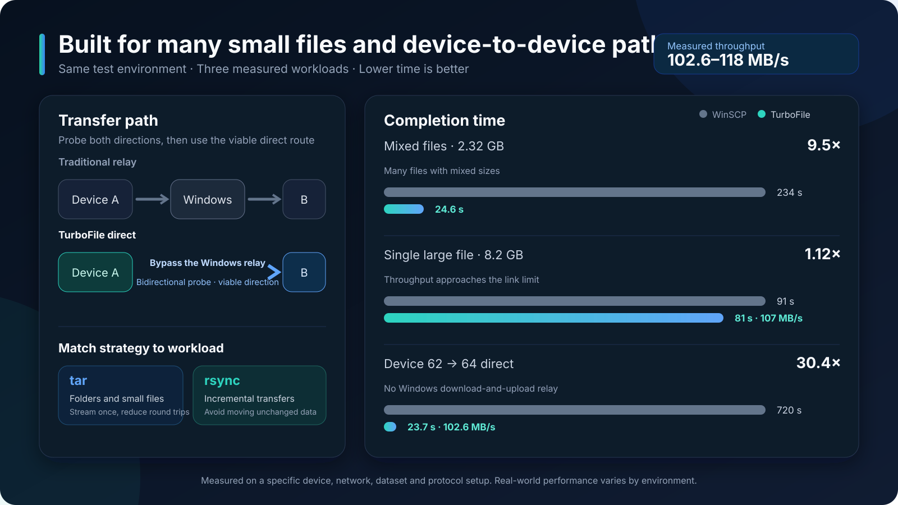

# ⚡ TurboFile (极速传)

  <strong>A high-speed dual-pane file workspace for Windows, SSH servers, NAS devices, and edge systems.</strong>

  Move data directly between devices, preview remote image datasets, edit files, and work in a terminal—without constantly switching tools.

  <a href="README_CN.md">简体中文</a> · <strong>English</strong>

> This is TurboFile's official public download and update repository. It contains product documentation, release installers, checksums, and update manifests only. Application source code is maintained in a separate private repository and is not distributed here.

  
  
  
  

  <a href="https://github.com/DMwarrior/TurboFile-Windows/releases/latest"><strong>Download the latest Windows installer</strong></a>

## Why TurboFile?

Traditional remote file tools often route a device-to-device copy through Windows: download from device A, then upload to device B. TurboFile probes both directions in the background, caches the viable route, and prefers a direct transfer when the endpoints can reach one another. When direct transfer is unavailable, it falls back to a compatible relay path.

The result is one workspace for local disks, Linux servers, NAS storage, and lightweight edge devices—with the transfer protocol selected around the actual workload.

## Highlights

| Capability | What it gives you |
| --- | --- |
| **Dual-pane workflow** | Browse any two local or remote locations and move files with drag-and-drop, copy/paste, or toolbar actions. |
| **Direct device transfer** | Detect reachable directions in advance and avoid a Windows relay when a valid direct route exists. |
| **Adaptive transfer strategies** | Use SCP/SFTP for compatibility, tar streaming for folders and many small files, and rsync for incremental workloads. |
| **Remote image workspace** | Open remote folders as an image grid, compare both sides, change grid density, sort by file size or image dimensions, and choose thumbnail-first or original-first quality. |
| **Integrated editing and terminal** | Edit text files and run terminal commands without leaving the file workspace. |
| **Broad device compatibility** | Use fast shell-based paths on full systems and compatible fallbacks on NAS and incomplete edge environments. |
| **Independent tasks** | Keep browsing, previewing, editing, and transferring while other non-conflicting operations continue. |

## Measured performance

In the recorded test environment:

- A 2.32 GB mixed-file workload completed in **24.6 s** with TurboFile and **234 s** with WinSCP.
- A single 8.2 GB file completed in **81 s** at about **107 MB/s**, versus **91 s** with WinSCP.
- A direct device 62 → 64 transfer completed in **23.7 s** at about **102.6 MB/s**, versus a **720 s** Windows-relayed workflow.

These figures describe one specific device, network, dataset, and protocol configuration. Real-world performance depends on storage, CPU, network quality, file distribution, endpoint tools, and the selected transfer strategy.

  

## Product tour

### Compare image datasets across two devices

Use both panes as synchronized image workspaces while keeping each device and path independent.

### Inspect remote images without downloading folders first

Open a server directory directly as an image grid. Thumbnail-first mode prioritizes responsiveness; original-first mode prioritizes image quality.

### Manage many endpoints from one place

Keep Windows, SSH, NAS, and edge-device connections together and open any two endpoints in the dual-pane workspace.

### Work with files and a terminal together

Keep the current remote paths visible while using the integrated terminal below them.

## Transfer model

TurboFile separates **reachability**, **protocol capability**, and **transfer strategy**:

1. When both panes are available, background probes learn which direction can reach the other endpoint.
2. The result is cached so a user action can start without repeating slow route detection.
3. The selected protocol is checked independently from network reachability.
4. The transfer uses the valid direct direction when possible; otherwise it uses a compatible relay or fallback path.
5. Directories and large batches can use a streaming strategy to reduce per-file round trips.

This design keeps fast paths fast without assuming every NAS or edge device exposes a complete Linux userland.

## Get started

1. Download [`TurboFileSetup-win32-x64-1.167.0.exe`](https://github.com/DMwarrior/TurboFile-Windows/releases/download/v1.167.0/TurboFileSetup-win32-x64-1.167.0.exe).
2. Install and launch TurboFile on Windows x64.
3. Add an SSH/NAS/edge-device connection, or choose a local Windows disk.
4. Open endpoints in the left and right panes.
5. Drag, copy/paste, or use the toolbar to transfer files and folders.

The release page also contains a SHA-256 checksum for installer verification.

## Downloads and automatic updates

- Versioned releases contain the Windows x64 installer and its SHA-256 checksum.
- The fixed `updater` release contains `update.json` and `update-proxy.json` for installed clients.
- TurboFile checks this public repository for a newer semantic version and downloads the matching installer when an update is available.
- Release packages are binaries only; this repository does not contain application source code.

## Project status

- Current public release: **v1.167.0**
- Current installer target: **Windows x64**
- Primary branch: **`main`**
- Issues and reproducible bug reports are welcome in [GitHub Issues](https://github.com/DMwarrior/TurboFile-Windows/issues).

## License and acknowledgements

TurboFile binaries are distributed under the [MIT License](LICENSE.txt). TurboFile is built on [Code - OSS](https://github.com/microsoft/vscode) and includes third-party components documented in [ThirdPartyNotices.txt](ThirdPartyNotices.txt).

WinSCP is a trademark of its respective owner. The benchmark above is an environment-specific interoperability comparison and does not imply affiliation or endorsement.
