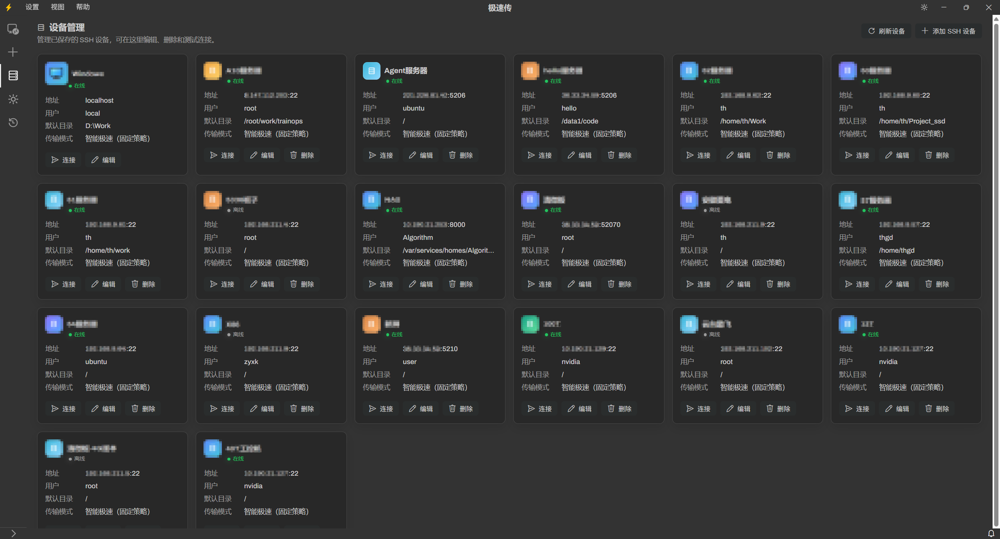

# ⚡ 极速传（TurboFile）

  <strong>面向 Windows、SSH 服务器、NAS 与边缘设备的高速双栏文件工作台。</strong>

  在设备之间直接传输数据，同时完成远端图片浏览、文件编辑与终端操作，不必反复切换软件。

  <strong>简体中文</strong> · <a href="README.md">English</a>

> 这是极速传官方公开下载与更新仓库，仅保存产品介绍、正式安装包、SHA-256 校验文件和更新清单。应用源码在独立私有仓库中维护，不在本仓库公开。

  
  
  
  

  <a href="https://github.com/DMwarrior/TurboFile-Windows/releases/latest"><strong>下载最新版 Windows 安装包</strong></a>

## 为什么选择极速传？

传统远程文件工具在执行设备到设备的复制时，经常需要先从设备 A 下载到 Windows，再从 Windows 上传到设备 B。极速传会在后台双向探测设备可达性，缓存正确的传输方向；当两端能够直连时优先走设备直传，无法直连时再使用兼容的中转路径。

本地磁盘、Linux 服务器、NAS 和轻量边缘设备可以放进同一个工作台，并根据实际文件特征选择合适的传输策略。

## 核心能力

| 能力 | 带来的体验 |
| --- | --- |
| **双栏文件管理** | 左右两侧可分别打开本地或远端路径，支持拖拽、复制粘贴和工具栏操作。 |
| **设备直连传输** | 提前识别可达方向，在具备直连条件时跳过 Windows 二次中转。 |
| **自适应传输策略** | SCP/SFTP 负责兼容性，tar 流式处理目录与大量小文件，rsync 适合增量任务。 |
| **远端图片工作台** | 服务器目录可直接进入图片网格，支持双侧对比、密度调整、按文件大小或图片尺寸排序，以及缩略图优先/原图优先。 |
| **编辑器与终端** | 无需离开文件工作台即可编辑文本、保存文件和执行终端命令。 |
| **兼容 NAS 与边缘设备** | 完整系统优先高速 Shell 路径，不完整系统自动使用兼容回退。 |
| **任务互不阻塞** | 非冲突操作可同时进行；传输期间仍可浏览、预览、编辑和继续创建任务。 |

## 实测性能

在本次记录的测试环境中：

- 2.32 GB 混合文件：极速传 **24.6 秒**，WinSCP **234 秒**。
- 8.2 GB 单个大文件：极速传 **81 秒 / 约 107 MB/s**，WinSCP **91 秒**。
- 设备 62 → 64 直连：极速传 **23.7 秒 / 约 102.6 MB/s**，Windows 中转方式 **720 秒**。

以上数据仅代表特定设备、网络、文件集和协议配置。实际表现会受到磁盘、CPU、网络质量、文件分布、设备工具完整性与传输策略等因素影响。

  

## 产品展示

### 双设备图片数据对比

左右面板可以同时作为图片网格使用，在保持设备与路径独立的同时快速对比两组数据。

### 不下载整个目录，直接浏览服务器图片

远端目录可直接切换为图片网格。缩略图优先更注重加载速度，原图优先更注重显示质量。

### 集中管理多台设备

把 Windows、SSH 服务器、NAS 和边缘设备统一管理，并从中选择任意两个端点进入双栏工作区。

### 文件与终端协同工作

远端目录始终保持可见，同时在下方终端执行训练、部署或运维命令。

## 传输逻辑

极速传将**网络可达性**、**协议能力**和**传输策略**分开处理：

1. 左右面板就绪后，在后台探测两端能够互相访问的方向。
2. 缓存探测结果，真正发起传输时不再重复等待慢速判断。
3. 协议可用性独立验证，避免把“某个工具不存在”误认为“设备不直连”。
4. 有正确直连方向时直接传输；无法直连时走兼容的中转或回退路径。
5. 目录和大量文件可使用流式策略，减少逐文件往返带来的耗时。

这套设计既保留完整 Linux 系统上的高速路径，也不假设 NAS 或边缘设备一定具备完整命令环境。

## 快速开始

1. 下载 [`TurboFileSetup-win32-x64-1.167.0.exe`](https://github.com/DMwarrior/TurboFile-Windows/releases/download/v1.167.0/TurboFileSetup-win32-x64-1.167.0.exe)。
2. 在 Windows x64 上安装并启动极速传。
3. 添加 SSH/NAS/边缘设备，或选择 Windows 本地磁盘。
4. 在左右面板分别打开源端和目标端。
5. 通过拖拽、复制粘贴或工具栏传输文件与文件夹。

Release 页面同时提供安装包 SHA-256 校验文件。

## 下载与自动更新

- 每个正式版本 Release 包含 Windows x64 安装包和对应的 SHA-256 校验文件。
- 固定的 `updater` Release 保存客户端使用的 `update.json` 与 `update-proxy.json`。
- 极速传会从这个公开仓库检查更高的语义化版本，并在发现更新后下载对应安装包。
- Release 仅提供编译后的程序，本仓库不包含应用源码。

## 项目状态

- 当前公开版本：**v1.167.0**
- 当前安装包平台：**Windows x64**
- 唯一主分支：**`main`**
- 欢迎通过 [GitHub Issues](https://github.com/DMwarrior/TurboFile-Windows/issues) 提交可复现的问题和建议。

## 开源协议与致谢

极速传二进制程序使用 [MIT License](LICENSE.txt) 发布，基于 [Code - OSS](https://github.com/microsoft/vscode) 构建；第三方组件信息见 [ThirdPartyNotices.txt](ThirdPartyNotices.txt)。

WinSCP 是其权利人的商标。本文性能数据仅用于特定测试环境下的互操作对比，不代表双方存在合作、授权或背书关系。
